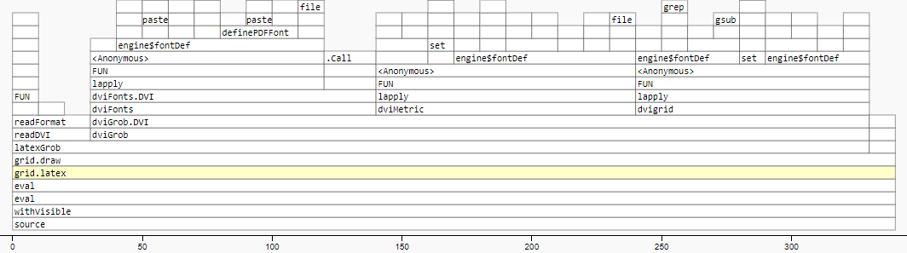

\newpage{}

# Code speed (part 1) - removing redundant font sweeps

<!---    
Profiling:
      Use initFOnts = TRUE
      Use prof mem or similar (see 769?) for multiple runs with just data output (no stuffing around with html things) - gives data and graphs
      Test for variability (this is important)
      If profiling, remove any time used for the "wrapper" stuff - ideally only focus on time spent in 'dvir' functions
      For some of the profiling, use example of text formatted in two columns (power of TeX) with equations. Maybe plot on one side and text on the other side with two grid viewports? To show it in action
      Use Cairo device specifically? Should I mention that? maybe in my code "system conditions" info, like version of ubuntu etc.....
      
      

NEED TO CHANGE EXAMPLE TO ENSURE HTML WIDGET IS CORRECT - MAYBE RERUN THEM WITH LATEST CODE FOR ALL DVIR VERSIONS?

> library(profvis)
> p <- profvis(plot(1:1000000))
> htmlwidgets::saveWidget(p, "profile.html")


First parse change:
  
  dvir/R/grid.R:grid_op_243 <- op_font_def
  dvir/R/metric.R:metric_info_243 <- op_font_def
  
    Set to op_ignore. And...
  
  [metric_info|grid_op]_247 to op_ignore (so that they do not
  RESET (or overwrite) the global fonts list (that font_info_243 set up)
  
  # Op code 247 is for preamble (so would reach ti at start of every parse through (Was it just
  # to clear anything cached?)
  # Op code 243 to 246 are all for font_def. Did we change all of them? Or just 243?
  # What happens if we find a 244?

Second parse change: (see meeting notes at start of 2021)

  + IF !initFonts THEN op_pre() should NOT reset "fonts" global
  + call it "dvir.initFonts"
  + use existing options() and getOption()
  + add new arg
    grid.latex(initFonts = getOption("dvir.initFonts"))
    change actually happens in latexGrob()
    change also happens in dviGrob()
  + dvir::set("initFonts") within dviGrob()
  + op_pre() only does set("fonts") IF get("initFonts")
  + op_font_def() needs to ...
    ALSO store font def 'op' object in fontdef
    if (is.null(get("fonts")[[fontnum]]))
       define font as normal
    else 
       if (identical(oldop, newop))
           do nothing
       else
           define font as normal
    
    Also created new identical_font() function
    Also had to change add ...
      
      if (get("initFonts") || is.null(get("fonts"))) set("fonts", vector("list", 255))
    ... in op_pre,
    
    So now if 'fonts' list in 'dvir' environment doesn't exist already, it is initialised regardless of 'initFonts'
    
    
dvir versions:
0.2-1 - Before any of my changes
0.2-2 - After first speed up 
0.3-1 - Before second speed up (had TikZ and all that, and font support changes)
0.3-2 - After second speed up
--->
In the introduction of this report the case for the `dvir` package was motivated with a simple example of a mathematical equation. `dvir` can be used on a larger scale too.

```{r eval = FALSE, echo = TRUE}
grid.latex("\\dots", x = 0.44, y = -0.1, default.units="native")
grid.latex("$Y_* =$", x = 0.5, y = 1.1, default.units="native")
grid.latex("$a_1$", xpos[1], y = -0.1, default.units="native")
grid.latex("$a_2$", xpos[2], y = -0.1, default.units="native")
grid.latex("$a_{L_A}$", xpos[3], y = -0.1, default.units="native")
grid.latex("$Y_{\\pi} | Y_{\\pi} \\notin \\cal{A}$", 
           x = xpos[4], y = -0.1, default.units="native")
grid.latex("$\\omega_1$", x = 0.18, y = 0.50, default.units="native")
grid.latex("$\\omega_2$", x = 0.32, y = 0.50, default.units="native")
grid.latex("$\\dots$", x = 0.44, y = 0.50, default.units="native")
grid.latex("$\\omega_{L_A}$",  x = 0.54, y = 0.50, default.units="native")
grid.latex("$1 - \\sum_{s=1}^{L_A}\\omega_s$", x = 0.95, y = 0.50, default.units="native")
```

```{r yeeExample, fig.cap="Using nine \\texttt{grid.latex()} calls with base R graphics.", fig.width = 4, fig.height = 3, fig.keep = "last", echo = FALSE}
xpos <- c(0, 0.25,  0.7, 1)
myplot <- function(abcd = "(a)", col = "black") {
  plot(1:9, 1:9, type = "n", xlim = c(0, 1), ylim = c(0, 1), 
       bty = "n", axes = F, xlab = "", ylab = "")
  arrows(0.5, 1, xpos, 0, length = 0.12, lwd = .7,
         col = col)  # All the arrows
  text(0.05, y = 1.1, xpd = TRUE, labels = abcd, cex = 1.0,
       font = 1, col = col)
}  # myplot
par(mar = c(1.6, 4, 1.5, 2) + 0.1,
    font = 3,  # italic
    las = 1)
myplot()
## Convert to grid
library(gridGraphics)
grid.echo()
## Make arrows "nicer" ? 
grid.edit("arrows", grep=TRUE,
          arrow=arrow(angle=10, length=unit(.12, "in"), type="closed"),
          gp=gpar(fill="black"))
## Navigate to plot window
downViewport("graphics-window-1-1")
## Use 'dvir' to draw labels
grid.latex("\\dots", x = 0.44, y = -0.1, default.units="native")
grid.latex("$Y_* =$",
           x = 0.5, y = 1.1, default.units="native")
grid.latex("$a_1$", xpos[1], y = -0.1, default.units="native")
grid.latex("$a_2$", xpos[2], y = -0.1, default.units="native")
grid.latex("$a_{L_A}$", xpos[3], y = -0.1, default.units="native")
grid.latex("$Y_{\\pi} | Y_{\\pi} \\notin \\cal{A}$",
           x = xpos[4], y = -0.1, default.units="native")
grid.latex("$\\omega_1$",
           x = 0.18, y = 0.50, default.units="native")
grid.latex("$\\omega_2$",
           x = 0.32, y = 0.50, default.units="native")
grid.latex("$\\dots$",
           x = 0.44, y = 0.50, default.units="native")
grid.latex("$\\omega_{L_A}$",
           x = 0.54, y = 0.50, default.units="native")
grid.latex("$1 - \\sum_{s=1}^{L_A}\\omega_s$",
           x = 0.95, y = 0.50, default.units="native")
```

The example in figure \@ref(fig:yeeExample) was created by a University of Auckland lecturer using the `dvir` package to help write an assignment.

One of the first things investigated in the package was the speed of running the code. Anecdotally, generating any R graphic with non-trivial \TeX{}, like that in figure \@ref(fig:yeeExample), took a long time so it was desirable to speed it up.

To look into this the first task was to profile the existing code to let us see where in the package time was being spent. This was in `dvir` version 0.2-1. The profiling results were visualised with `profvis::profvis()`.

<!---
These are old examples of profvis() output. Need to refresh them!
--->

<!---
How to include and reference figures:

https://community.rstudio.com/t/cross-reference-images-in-rmarkdown/83402/2
--->
```{r prof1, fig.cap = "Screenshot of \\texttt{profvis::profvis()} output for the simple example in \\texttt{dvir} version 0.2-1.", echo = FALSE, eval = TRUE, out.width='100%'}

```

We can see the function call stack in figure \@ref(fig:prof1). At the bottom is the call to `grid.latex()`, which immediately calls `grid.draw()` which in turn calls `latexGrob()`. This calls `readDVI()` for about the first 20ms, then `dviGrob()` for the remaining time to the end of the original `grid.latex()` function call, and so on up the function call stack.

```{r prof2, fig.cap = "Screenshot of \\texttt{profvis::profvis()} output for the code creating the example at the start of this section, highlighting the time spent in \\texttt{engine\\$fontDef}.", echo = FALSE, eval = TRUE, out.width='100%'}

```
<!---
Caption for above figure....
Screenshot of 'profvis::profvis()' output for the code creating the example at the start of this section, highlighting the time spent in 'engine$fontDef'.
--->

The `profvis::profvis()` output for our more complicated example, in figure \@ref(fig:prof2) reveals most of the time to create the figure is in `grid.latex()`. Note that the code to draw the arrows and the "(a)" in this example is so quick it occupies the very skinny call stack on the far left of the graph. `grid.latex()` and its subsequent function calls, on the other hand, take up most of the time required to produce the example.

In figure \@ref(fig:prof2) some blocks in the call stack have been highlighted - these are related to the `engine$fontDef` operation occuring. This is a part of the "font sweep", as was described in the introduction to `dvir` in section \@ref(dvirDesc).

In the top left corner of figure \@ref(fig:prof2) we are told the aggregate time spent with `engine$fontDef` is 1830ms. Compared to the total time of this run (a total of about 2700ms), `dvir` is spending a *lot* of time doing these font sweeps.

What was interesting though was that after the actual font sweep the following sweeps for the metric and grid information *also* called `engine$fontDef`. As the point of the font sweep is that it finds all the font information to be used later on the following metric and grid sweeps should not need to "re-sweep" for the fonts.

```{r prof3, fig.cap = "Screenshot of \\texttt{profvis::profvis()} output for the simple example in \\texttt{dvir} version 0.2-1, highlighting \\texttt{engine\\$fontDef}.", echo = FALSE, eval = TRUE, out.width='100%'}
include_graphics("../Figures/profilingSimpleProfvis_0.2-1_highlight.PNG")
```

<!---
Caption for above...
Screenshot of 'profvis::profvis()' output for the simple example in 'dvir' version 0.2-1, highlighting 'engine$fontDef'.

--->
The effect of this is very obvious in figure \@ref(fig:prof3) which is the same as figure \@ref(fig:prof1) but highlights the time spent in `engine$fontDef`. The wrappers for the font, metric and grid sweeps are `dviFonts()`, `dviMetric()` and `dvigrid()` respectively (sixth call from the bottom of the stack). Here we can see nearly all of the time spent in the metric and grid sweeps are actually redoing the font sweep.

The change to be made was simply stopping the metric and grid sweeps from doing the font sweep again.

<!--- 
Is this font sweep rewriting earlier`dvir` description? If not, should this go up there?
--->

The font sweep looks in the DVI file for op codes 243 to 246. These are the op codes for font definitions and define the name of a font and give it an identifier to reference in the DVI file when it wants to use that font to display a character. 

<!---
Need figure captions here on these code examples

I think in the package code I changed, it only refered to op code 243. Check if the other ones were also affected (244 to 246). Does font sweep do all four op codes? May need to update this bit depending on outcome

For my own learning - learn how these op codes thing work (like how the functions themselves aren't actually called) - shoul go through function process again now that I nudnerstand it more! Could be important for presentation.
--->

The following code is taken from the the `dvir` package, showing where the metric and grid sweeps also redid the font sweep. `op_font_def` is a function which takes the font definition in the DVI file related to that instance of the op code and searches for and records the font information. 

```{r metricFont_0.2-1, fig.cap="Metric sweep searching and recording font information in package version 0.2-1, in package file \\texttt{dvir/R/metric.R}", eval=FALSE}
metric_info_243 <- op_font_def
grid_op_243 <- op_font_def
```

The following code shows what the code was changed to in `dvir` version 0.2-2. `op_ignore` is an empty function, so when the metric or grid sweeps comes across that op code, they now do nothing.

```{r metricFont_0.2-2, fig.cap="Metric sweep now *not* searching and recording font information in package version 0.2-2, in package file \\texttt{dvir/R/metric.R}", eval=FALSE}
metric_info_243 <- op_ignore
grid_op_243 <- op_ignore
```

Unfortunately these changes by themself caused an error when running `grid.latex()`. This is because one task undertaken before the font sweep is to reset or overwrite the global fonts list (which the font sweep then writes to). The metric and grid sweeps were also doing this even though it was only intended for it to be done by the font sweep. This meant after the font sweep was completed it was overwritten by the metric and grid sweeps and so when `dvir` tried to draw the characters there was no font information to refer to.

The resetting of the global fonts list was initiated when the sweeps passed op code 247 in the DVI file, which is the preamble at the start of every DVI file. Setting the metric and grid sweeps to do nothing when they pass the preamble of the DVI file, again by way of `op_ignore`, solved this problem as the global fonts list created by the font sweep is now not overwritten.

```{r metricGlobalFont_0.2-2, fig.cap="Metric sweep now *not* resetting the global fonts list in package version 0.2-2, in package file \\texttt{dvir/R/metric.R}", eval=FALSE}
metric_info_247 <- op_ignore
grid_op_247 <- op_ignore
```

<!---
Do we want another `profvis()` output here showing the change? Might be good for visual impact. Especially simple example
--->

To quantify the impact this has on code speed the time to run the examples 20 times was recorded, after an initial run to compile the package after it was loaded. The average of these 20 runs was then calculated.

```{r echo = FALSE, eval = TRUE}
dvirLibs <- c("/media/sf_Honours_project/VM_18.04/dvir0.2-1",
              "/media/sf_Honours_project/VM_18.04/dvir0.2-2",
              "/media/sf_Honours_project/VM_18.04/dvir0.3-1",
              "/media/sf_Honours_project/VM_18.04/dvir0.3-2")
simpleProfResults <- gsub("/.+/.+/.+/", "../Profiling/simple_", dvirLibs)
yeeProfResults <- gsub("simple", "yee", simpleProfResults)

measurements <- c("Total time",
                  "Total time 'grid.latex()'",
                  "Total time 'dviMetric()'",
                  "Total time 'dvigrid()'",
                  "Total time 'dviFonts()'")

results <- list()
for (k in c(simpleProfResults, yeeProfResults)) {
  x <- summaryRprof(k)
  results[[k]][[measurements[1]]] <- 
    x$sampling.time
  results[[k]][[measurements[2]]] <- 
    x$by.total['"grid.latex"',"total.time"]
  results[[k]][[measurements[3]]] <- 
    x$by.total['"dviMetric"',"total.time"]
  results[[k]][[measurements[4]]] <- 
    x$by.total['"dvigrid"',"total.time"]
  results[[k]][[measurements[5]]] <- 
    x$by.total['"engine$fontDef"',"total.time"]
  if (k == simpleProfResults[4] | k == yeeProfResults[4]) {
    results[[k]][[measurements[5]]] <- 
      x$by.total['"dviFonts"',"total.time"]
  }
}
```

```{r, echo = FALSE, eval = TRUE}
resultDF <- data.frame(time = c(results[[1]][[2]],
                                results[[5]][[2]],
                                results[[1]][[3]],
                                results[[5]][[3]],
                                results[[1]][[4]],
                                results[[5]][[4]],
                                results[[2]][[2]],
                                results[[6]][[2]],
                                results[[2]][[3]],
                                results[[6]][[3]],
                                results[[2]][[4]],
                                results[[6]][[4]]),
                       version = rep(c("Before", "After"), 
                                     each = 6),
                       func = rep(c("gridlatex", "metric", "grid"),
                                  each = 2),
                       example = c("simple", "yee"))
resultDF$time <- resultDF$time / 20
```

```{r, eval = TRUE, echo = FALSE}
plotProfiling1 <- function(ex, versionLabels, results, levels) {
  p <- ggplot(results[results$example == ex, ]) + 
    geom_col(aes(x = version, 
                 y = time,
                 col = version,
                 fill = version)) +
    facet_grid(cols = vars(factor(func, levels = levels))) +
    scale_x_discrete(limits = c("Before", "After"),
                     expand = rep(0, 2)) +
    scale_y_continuous(expand = expansion(mult = c(0, 0.05))) +
    scale_fill_discrete(name = "dvir Version",
                        limits = c("Before", "After"),
                        labels = versionLabels) +
    scale_color_discrete(name = "dvir Version",
                         limits = c("Before", "After"),
                         labels = versionLabels) +
    labs(x = NULL, y = "Total time\n(ms)") +
    theme(axis.ticks.x = element_blank(),
          axis.text.x = element_blank(),
          panel.spacing.x = unit(1.5, "lines"))
          #strip.text.x = element_text(family = c("mono", "sans")))
  p
}

versionLabels <- c(Before = "0.2-1 (before changes)", 
                   After = "0.2-2 (after changes)")
levels1 <- c("gridlatex", "metric", "grid")
```

```{r speedUp1Simple, fig.cap = "The average time spent in the \\texttt{grid.latex()} function, metric sweep and grid sweep before and after these changes, over 20 runs of the simple example.", echo = FALSE, fig.width = 7, fig.height = 4}
plotProfiling1("simple", versionLabels, results = resultDF, levels = levels1)
```

For the simple example the time spent in the metric and grid sweeps have decreased by 76% and 83% respectively. The speed of the overall `grid.latex()` call has decreased by 30%.

```{r speedUp1Yee, fig.cap = "The average time spent in the \\texttt{grid.latex()} function, metric sweep and grid sweep before and after these changes, over 20 runs of the complicated example.", echo = FALSE, fig.width = 7, fig.height = 4}
plotProfiling1("yee", versionLabels, results = resultDF, levels = levels1)
```

Similarly for the more complicated example in figure \@ref(fig:speedUp1Yee) the metric and grid sweeps have decreased by 83% and 89% respectively, with `grid.latex()` overall taking 47% less time.
<!---
For plot, maybe 2 by 3 facet wrap thing? rows are examples, columns are the part of the function that's sped up

Need to adjust on plot:
-Y axis gorizontal
-Width of plot
-Titles on each column
-Maybe move x axis label to be legend title to keep it in one place
-make dvir monospace
-move legend title to right
--->

<!---
This section needs:
-Use https://bookdown.org/yihui/rmarkdown-cookbook/kableextra.html for formatting the table!
-Table above finished, with caption and nicely explaining everything, with nice formatting too (nice explanatory headers etc.)
-Make tables like figures (give caption I reckon, and numbers so I can refer to them in my summary)
-Summary of results
-Above code hidden
--->

<!---
Need to actually check these results (that I summarised the right info with my R code)

Does engine$fontDef show up in Rprof results?
--->