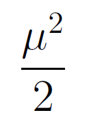

```{r setup, include=FALSE}
knitr::opts_chunk$set(echo = TRUE, fig.align="center", out.width='70%')
```

## Introduction

R has the ability to display mathematical symbols and equations in graphics using the "*plotmath*" feature, interpreting everything within a call to `expression()` as a mathematical equation.

<!--- Need to think of a better example than this one, ideally one that brings in our x - mu somehow --->

```{r}
mu <- 1:5
opar <- par(mar = par()$mar + c(0, 1, 0, 0))
plot(mu, mu ^ 2 / 2, xlab = expression(mu), ylab = "", yaxt = "n")
axis(2, las = 1)
mtext(expression(frac(mu ^ 2, 2)), side = 2, line = 3, las = 1)
par(opar)
```

This provides us with most of the symbols used for equations, such as brackets and fractions, and formats them in a layout resembling \TeX, but it is limited in its fonts. Compare the y-axis label above with how it would look if created in a \LaTeX  document.

{width=5%}

<!--- could just write the TeX code ...

  \dfrac{\mu^2}{2}

... directly in this doc to be rendered when it's knitted? --->

The difference is stark and there are several approaches in R which can get us closer to the \LaTeX  result (Murrell, 2018 [Revisiting Mathematical Equations in R: The 'dvir' package]).

- Do I include examples of the following approaches (whether replicating examples from original report (with credit), or creating my own)?

  - [**Example:** use `extrafont` and `fontcm` packages, embed CM fonts in PDF]

  - [**Example:** use `tikzDevice` package, which creates PGF/TikZ version of plot (and as such converts all text in plot to LaTeX (including labels))]

What we want is a middle ground - being able to harness the power of \TeX  and its typsetting capabilities in R graphics on our choice of text or equation. This is where the `dvir` package comes in.

The `dvir` package provides a simple user interface, in the style of the R `grid` graphics package [Reference R grid graphics here], by way of the `grid.latex()` function:

  - [**Example:** example of grid-based plot, changing labels and/or title with `grid.latex()`. Maybe ggplot2?]

## So why the project?

The `dvir` package works really well for a lot of 'base' cases. The power of this package though is by ensuring it is comprehensive enough for a user to create all the \TeX on their R graphics without having to leave R and go to \LaTeX 

* Speed of the package, specifically the time taken between submitting a `grid.latex()` command and the typset \TeX  appearing on the graphics device.
* 


`dvir`, in a simplified form, works as follows:

- A high level function provided by the package, `grid.latex()`, is called with the \TeX  code of the expression or text to be displayed on the R graphic.

```{r eval=FALSE}
library(dvir)
grid.latex("$x - \\mu$")
```
  
* `dvir` creates a TeX document with the expression and a changeable default preamble and postamble.

  - [**Example:** TeX document with pre- and post-amble]
  
* This TeX document is then processed using the local \TeX installation to create a DVI (DeVice Independent) file. A DVI file describes the visual layout of the document to produce but is not specific to any type of output file (PDF, HTML, etc.)
  
* The DVI file is read into R. DVI files are binary so are not easily readable by humans but `dvir::readDVI()` allows us to inspect the information inside.

  - [**Example:** Extract of DVI file using `readDVI()` (not the whole thing, just the bit relevant to our example ($x - \mu$))]
  
* Three 'sweeps' of the DVI file are completed to extract necessary information about what to display in R (and how to display it):
  
  + Font sweep: Gather the names of all fonts used in the DVI file and locate the relevant font files on the local machine. The font information is stored in a R list as well as a `fontconfig` file.
  
  + Metric sweep: To determine the overall bounding box (size) of the expression to display. This bounding box is used to create a grid viewport which can encompass all of the expression using the native DVI coordinates.
  
  + Grid sweep: Convert all text and symbols into *grobs* (grid graphical objects) 

* These *grobs* are then displayed in the R graphics device.


## Code speed (part 1) - remove redundant `font` sweeps

Now that the package "works" there is opportunity to expand its scope and usefulness. In the introduction of this report the case for the `dvir` package was motivated with a simple example of a mathematical equation. `dvir` can be used in larger cases too.

\- [**Example:** Thomas Yee's example]

One of the first things investigated in the package was the speed of running the code. Anecdotally, generating any R graphic with non-trivial \TeX, like the example above, took a long time and as such improving the time efficiency of the package was very desirous.

To tackle this, and indeed find out whether  even was the case, the first task was to profile the existing code to see where the time was being spent whenever the code was run. We used our two examples: the simple $x - \mu$ and our larger example above.

\- [**Example:** `profvis()` screenshot of simple example, showing `definePDFFont()` (before change)]

\- [**Example:** `profvis()` screenshot of Thomas Yee's example, showing `definePDFFont()` (before change)]

\- [**Example:** `profmem()` of simple example, calculate average time taken (before change)]

\- [**Example:** `profmem()` of Thomas Yee's example, calculate average time taken (before change)]

Using `profvis::profvis()` we were able to visually explore how the time was spent in these examples. In ten runs of the motivating example, the total average execution time was about 6269ms. Of this, about 3393ms on average, or 54%, was spent in calls to the `dvir` function `definePDFFont()`. 

The purpose of `definePDFFont()` is to do a sweep of the DVI file from `grid.latex()` looking for all fonts required, before recording the font names in the font config file, searching the relevant directories for the font files and encoding the fonts. A variable `fonts` is saved with all this information. The further sweeps over the DVI file to determine the bounding box of each character and thus entire image, and to create grid grobs and viewports each redundantly called `definePDFFont()` rather than referring to the already existing variable `fonts` from the first sweep.

This was therefore an easy and quick win - simply changing the subsequent sweeps to ignore the font-defining op code and instead referring to the `fonts` variable created from the font sweep.

\- [**Example:** `profvis()` screenshot of simple example, showing `definePDFFont()` (after change)]

\- [**Example:** `profvis()` screenshot of Thomas Yee's example, showing `definePDFFont()` (after change)]

\- [**Example:** `profmem()` of simple example, calculate average time taken (after change)]

\- [**Example:** `profmem()` of Thomas Yee's example, calculate average time taken (after change)]

This resulted in fantastic savings. In 10 runs of the example after this change was made, the average total execution time was 3712ms. This is a reduction of 2557ms, or 41%. The average time spent in `definePDFFont()` was just 1292ms, 62% less than before. A saving of nearly two thirds in the function is consistent with removing two of the three font sweeps based on the code profiling results above. 

## Code speed (part 2) - font caching

The earlier code speed up was done by stopping `dvir` doing something silly (completing a font sweep three times instead of only one). Our further profiling lead us to find where next our code spends its time and now it was a matter of making `dvir` "smarter".

\- [**Example:** `profvis()` result showing `fontEnc()` (I think) taking long time]

- Looks like if we could save/cache a font we could reduce the amount of time to run `grid.latex()`

- `fonts` R list is re-initialised after every call to `grid.latex()`

- Is a font definition in DVI the same over different calls to `grid.latex()`? Yes! even the font def number (a number seemingly determined by TeX)

\- [**Example:** font definitions from DVI file (over multiple `grid.latex()` calls) showing same fonts have same def]

- first of all we want the `fonts` R list to persist over multiple `grid.latex()` calls in an R session. We did this by storing fonts list in the `dvir` environment (using `dvir::set()` and `dvir::get()`)

- When come across a font definition (during a font sweep), we check if that font exists - the position in `fonts` list is determined by the font def number, and so as the same fonts (theoretically) have the same font def number, we can compare the new font we've come across with what is existing in that position in the `fonts` list. If nothing exists in that position in the list, then we save it as normal. If a font does exist, then we need to check if it's the same (just in case the font def number is not unique for different fonts across different `grid.latex()` calls)

  + To do this easiest way was to expand the stored information about fonts in `fonts` to include the hex code chunk (from DVI) of the font definition

  + Then we check if all parts of the new hex code chunk are the same as the existing
  
  + [**Example:** code for new function for checking if two font definitions are the same]
  
  + If the definitions are the same, do nothing. If they are different, overwrite the existing font info with the new font info. This actually removes any concern about using only the font def number (which we're pretty sure stays the same for the same font, but maybe it doesn't) 

  + Only requirement is that the font def number is unique within a single call to grid.latex() (or rather the resulting DVI output)

- Now only need to change the initialisation (reset) of fonts list to happen on package load, rather than during `grid.latex()` call (because doing it every `grid.latex()` call defeats the purpose of storing fonts). Occasionally one might still want to reset the font cache, so added an option `options(dvir.initFonts = FALSE)` and added `initFonts = getOption("dvir.initFonts")` to `dviGrob.character()` and `dviGrob.DVI()`

  + [**Example:** show function calls with the above, and anything else that helps explain them]

But why to each of these steps? Need to flesh out more why they achieve what we want it to achieve (and any considerations we had in our thought process)

- [**Example:** Profiling results (`profvis()` and `profmem()` showing speed improvement)]

## Gradient fills

New R version (currently in development 4.1.*) supports gradient fills in `grid` graphics.

## Font support (for reference, probably not to include in report)

An issue we discovered, somewhat unintentionally, was our examples were not rendering correctly on Ubuntu 20.04. Previously `dvir` had been created and tested only on Ubuntu 18.04 (is this correct?)

`dvir` on Ubuntu 20.04 did not reproduce our examples as expected - sometimes characters would display as a square with numbers inside (indicating there is no glyph for that given character in the incorrectly selected font), or the symbol was correct, but was the wrong font. It was discovered that the Computer Modern fonts weren't being used as the latest vesion of Pango (version 1.44 is used in Ubuntu 20.04) does not support True Type fonts. The `.pfb` Computer Modern fonts are on the computer, so Pango is specifically refusing to use them. I think the Cairo graphics device gave us the right characters, but wrong font, but pdf device gave us just the squares.

Potential solutions to this:
  
  * Get an OpenType CM font (Like BaKoMa font) - at least CMSY font
      This sort of worked, but the encodings of the font were wrong. Our mu came up as theta, for example
      So we need to find CM font with correct encodings, or use something like fontforge (fonttools/ttx?) to manually edit encodings.
      Paul found some other potential fonts that had the right encodings
      If the above worked, then we'd need a way to install or edit the fonts on a user's computer.
      
  * Create 18.04 Docker Image, which dvir would call when it needs to do its TeX processing
      Requires Docker on user's computer, for them to create a container using the image (which may be run automatically through dvir)
      Have created a docker image, but docker file needs tidying (installs some things that are needed for Paul's report, not dvir itself)
      
Paul's work at the end of 2020 has solved this problem in the the latest version of `dvir`: https://www.stat.auckland.ac.nz/~paul/Reports/dvir/type1/dvir-type1.html 
  


## Bibliography

References to maybe include (if/where relevant):

- All 'dvir' tech reports

- Donald Knuth for TeX

- PGF/TikZ

- R intro

- R base graphics?

- R grid graphics

<!---
@techreport{murrell-echogrob,
  title="Revisiting Mathematical Equations in R: the 'dvir' package",
  author = {Paul Murrell},
  year={2018},
  note={version 2},
  institution={Department of Statistics, The University of Auckland},
  number={2018-08}
}
--->

